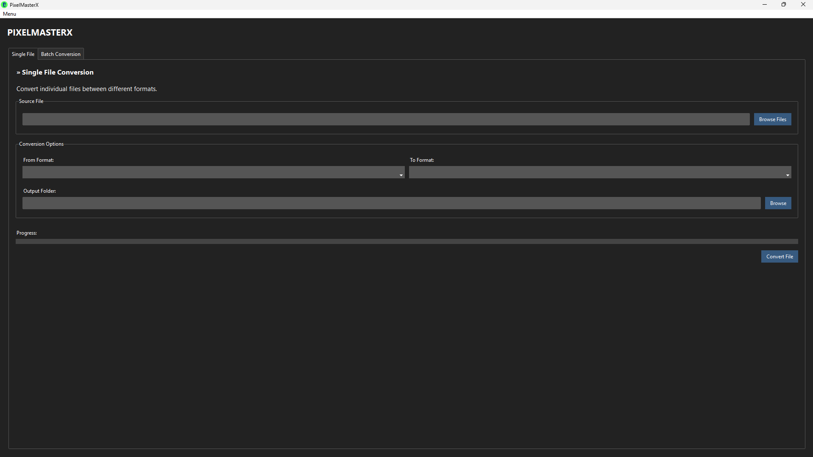

# PixelMasterX

PixelMasterX is a modern desktop application built with Python and Tkinter (using ttkbootstrap) for converting files between various formats and removing backgrounds from images. It features a clean home menu, single and batch file conversion, a background remover, and a user-friendly dark-themed interface.

## Features
- Home menu for easy navigation
- Convert single or multiple files at once
- Remove backgrounds from images with a single click
- Supports popular image formats: PNG, JPG, JPEG, GIF, BMP, WEBP, TIFF
- Supports popular audio formats: MP3, WAV, AAC, OGG, FLAC
- Batch conversion with automatic output folder creation
- Remembers window size and position
- Modern dark theme using ttkbootstrap
- Simple pop-up notifications for conversion and background removal status

## Requirements
- Python 3.7+
- [FFmpeg](https://ffmpeg.org/) (required for audio conversions)
- Additional dependencies listed in requirements.txt

## Installation
1. Clone or download this repository.
2. Install dependencies:
   ```bash
   pip install -r requirements.txt
   ```
3. (Optional) Install FFmpeg and ensure it is in your system PATH for audio conversions.

## Usage
Run the application with:
```bash
python main.py
```

or boot the main.exe file which can be downloaded from the releases section.

- Use the home menu to select File Conversion or Remove Background.
- For batch conversions, all selected files must be of the same format.
- To remove backgrounds from images, use the dedicated Remove Background screen.
- Pop-up notifications will inform you of conversion and background removal status.

## File Structure
- `main.py` - Application entry point
- `GUI.py` - GUI layout, navigation, and logic
- `Limiter.py` - Controller for file operations and conversions
- `Conversions.py` - Supported formats and conversion rules
- `BackgroundRemover.py` - Image background removal functionality
- `Converter.py` - File conversion functionality
- `FileHandler.py` - File selection and path management
- `Menu.py` - Home menu page
- `requirements.txt` - Python dependencies
- `favicon.ico` - Application icon
- `Screenshots/` - Screenshots and sample images

## Screenshots
Screenshots are available in the `Screenshots/` folder.


## License
Check out [LICENSE](LICENSE) for details.

## Contributing
Contributions are welcome! Please fork the repository and submit a pull request with your changes. Ensure your code adheres to the project's coding standards and includes appropriate tests. Alternatively, you can email me at mail@derekyuan.co.uk for any suggestions or issues.